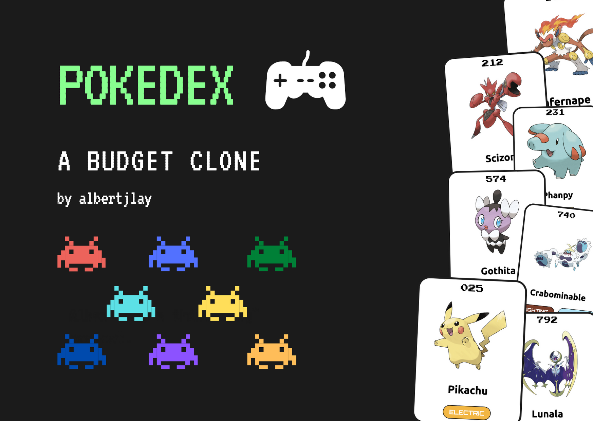
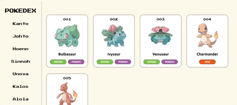
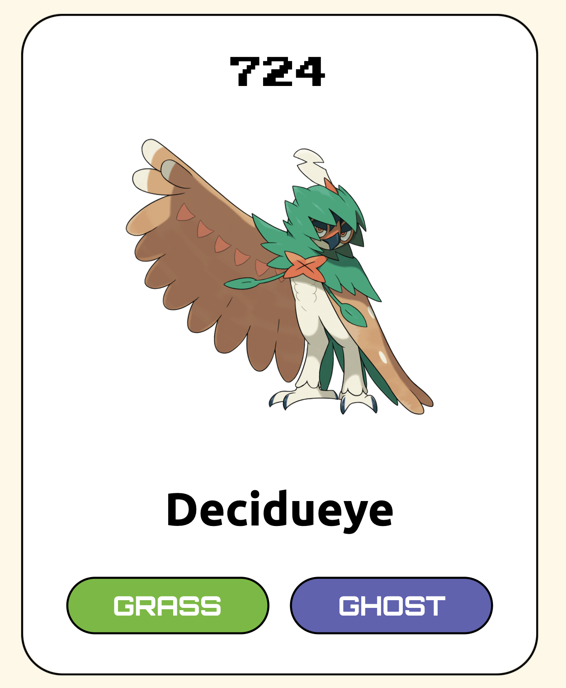
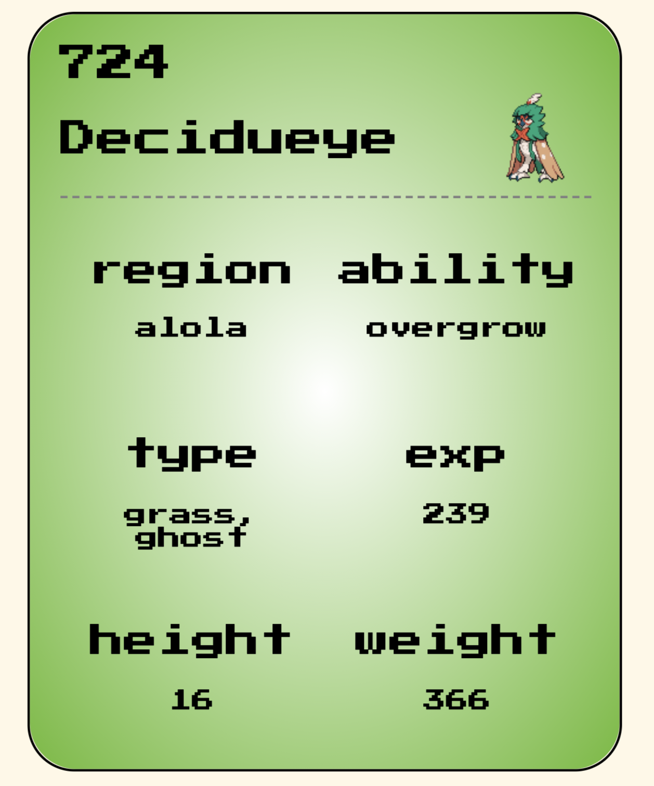

# [Pokedex](https://albertjlay.github.io/pokedex/)



- [Pokedex](#pokedex)
  - [:rocket: Overview](#rocket-overview)
    - [:dragon: 809 Pokemon from seven regions](#dragon-809-pokemon-from-seven-regions)
    - [:black_joker: Custom-designed cards with card-flipping animation](#black_joker-custom-designed-cards-with-card-flipping-animation)
    - [:iphone: Responsive design suitable for mobile-viewing](#iphone-responsive-design-suitable-for-mobile-viewing)
  - [:man_technologist: My process](#man_technologist-my-process)
    - [:hammer_and_pick: Tools](#hammer_and_pick-tools)
      - [Languages](#languages)
      - [Tools](#tools)
  - [:books: What I learned](#books-what-i-learned)
    - [First-time for everything. Literally.](#first-time-for-everything-literally)
    - [Async is confusing](#async-is-confusing)
    - [Plan. Plan. Plan.](#plan-plan-plan)
    - [Documentation is **super** important](#documentation-is-super-important)
  - [:crystal_ball: Continued development](#crystal_ball-continued-development)
  - [:unicorn: Helpful resources](#unicorn-helpful-resources)
  - [:handshake: Acknowledgments](#handshake-acknowledgments)

## :rocket: Overview

A web-based clone of the Pokedex from the popular Pokemon series based on data from [PokeAPI](https://pokeapi.co/) and images from [Pokeres - Bastion](https://pokeres.bastionbot.org/) :star_struck:. Displays various stats of each Pokemon and styles each card dynamically according to the Pokemon's primary type. A responsive design that allows comfortable viewing, no matter the screen size.

### :dragon: 809 Pokemon from seven regions


### :black_joker: Custom-designed cards with card-flipping animation

|                                    Front-view                                    |                                   Back-view                                    |
| :------------------------------------------------------------------------------: | :----------------------------------------------------------------------------: |
|  |  |

### :iphone: Responsive design suitable for mobile-viewing


## :man_technologist: My process

### :hammer_and_pick: Tools

#### Languages

  

#### Tools

 

## :books: What I learned

### First-time for everything. Literally.

I tried out a lot of new things in this project. It was the first web-based project that I did a lot of the things on my own (although still lots of Googling!). A few of the firsts in this project:

- Using a third-party API (or any API for that matter!)
- Trying to follow a style guide for JavaScript (I used AirBnB's style guide) and using a linter
- Dynamically rendering my HTML and CSS based on the response of an API

### Async is confusing

Watching other people use async functions was no big deal, writing them is another beast. One of the main obstacles I encountered was that my Pokemon entries were loading sooner than others, even when they have later IDs. I spent almost three hours trying to figure out how to make these things work :tired_face:, but what I arrived in is a solution considered bad practice by AirBnB's style (await inside loops).

```js
for (let i = start; i <= end; i += 1) {
  await fetchPokeData(i);
}
```

I guess this suffices for now, but I'm definitely going to brush up my async and AJAX skills ASAP!

### Plan. Plan. Plan.

About halfway through the project, I decided I wanted to make the cards flip when I hover through them. I was able to do this thanks to a very helpful tutorial by [Arjun Khara](https://www.youtube.com/watch?v=OV8MVmtgmoY). As you can probably guess, I had to change up a whole lot of HTML and CSS to make implement that.

```css
/* The card-flipping magic */
.entry {
  transform-style: preserve-3d;
  transition: all 0.5s ease;
}
.entry:hover {
  transform: rotateY(180deg);
}
.back {
  transform: rotateY(180deg);
}
```

In hindsight, the development process would be much smoother if I actually planned things out from the get-go :writing_hand:, instead of delving right into the code. I've read a lot of advice about this, but this has been a huge wake-up call.

### Documentation is **super** important

About 75% into the project, I started getting confused navigating my code. At this point, I realized I was spending more time reading past code instead of writing new ones. I can't imagine if this project was twice as big!

A huge reason for this is because I have documented my code poorly, trying to follow a documentation guide set by one of my first-year course (CS136). It didn't even occur to me that there's a convention! This was when I discovered [JSDoc](https://jsdoc.app/) and I'll be using this in my future projects :crossed_fingers:

## :crystal_ball: Continued development

- Refactor code into classes and modules with the help of Webpack
- Set automatic unit and integration tests using Jest
- Optimize mobile UI
- ...and **much much** more!

## :unicorn: Helpful resources

- [Pokedex idea from Florin Pop](https://www.youtube.com/watch?v=XL68br6JyYs&t=493s)
- [CSS flip card animation from Arjun Khara](https://www.youtube.com/watch?v=XL68br6JyYs&t=493s)
- [Horizontal scrolling from Laravel Article](https://www.youtube.com/watch?v=2_E5uoiLCLY)

## :handshake: Acknowledgments

I tried my best to do as much on my own in this project. However, as a beginner, I had to look up a lot of things and had to receive guidance from a lot of amazing creators! This has certainly been a great learning experience.

The big parts I have needed help on came from the three resources I documented above. I did not simply copy and paste them. For the pokedex idea from Florin Pop, I added lots of new features and coded much of the source code on my own. For the other two, I learned the general idea from the creators, but I also made it my own by trying to implement them in my code.
